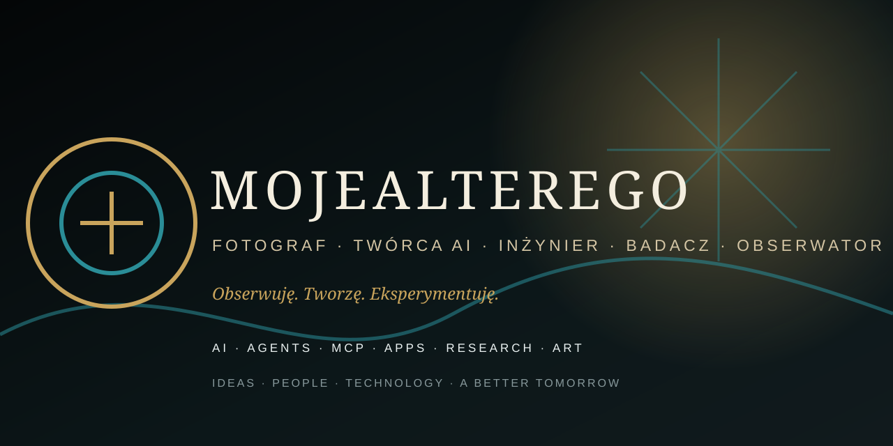

# MOJEALTEREGO

### FOTOGRAF · TWÓRCA AI · INŻYNIER · BADACZ · OBSERWATOR

> Obserwuję. Tworzę. Eksperymentuję.

## KIM JESTEM

Łączę fotografię, dokument, słowo, technologię i eksperyment.

MojeAlterego to ekosystem pracy obejmujący AI, autonomiczne agenty, MCP, aplikacje mobilne, prywatne sieci, badania, fotografię, film i publikowanie.

## OBSZARY

🧠 AI & AGENTS · 🔌 MCP & INFRASTRUCTURE · 📱 MOBILE & ANDROID · 📡 TELECOM / 4G / 5G · 🔬 RESEARCH & R&D · 📷 PHOTOGRAPHY & ART · 📚 BOOKS & PUBLISHING · ⚙️ TOOLS & EXPERIMENTS

## WYBRANE PROJEKTY

[MINI-MOBILE-7](../../mini-mobile-7) · [JARVIS-2.0](../../JARVIS-2.0) · [wda-photo-agent](../../wda-photo-agent) · [OmniMAS-Advanced](../../OmniMAS-Advanced) · [Knowledge-projects](../../Knowledge-projects) · [CCR-WORLD](../../CCR-WORLD)

## TECHNOLOGIA

Python · Kotlin · Android · Linux · Docker · Open5GS · IMS · eBPF · PostgreSQL · React · OpenAI · ElevenLabs · MCP · GitHub Actions

## LICZBY

2000+ nagród, wyróżnień i akceptacji · 300+ wystaw zbiorowych · 40+ krajów · 16 wystaw indywidualnych · 75 000+ członków społeczności fotograficznej

## LINKI

[Website](https://mojealterego.github.io/) · [Photography](https://fotografiauliczna.pl/)

---

### IDEAS · PEOPLE · TECHNOLOGY · ART

**A BETTER TOMORROW**
